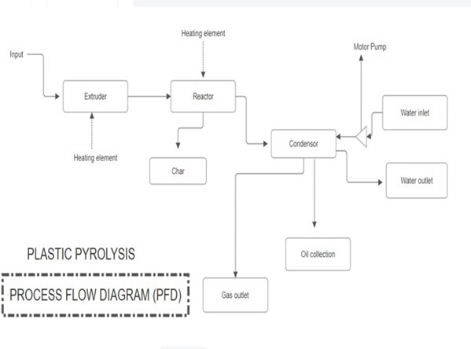

# 🔬 DESIGN AND DEVELOPMENT OF PLASTIC PYROLYSIS Reactor System

**Transform plastic waste into valuable energy resources through sustainable thermal decomposition**


---

## 📋 Overview

This project presents a comprehensive **design and development of a plastic pyrolysis reactor system** engineered to convert plastic waste into useful products including fuel oil, char, and combustible gases. The system represents a sustainable solution to the growing problem of plastic waste while recovering energy value from discarded materials.

### Problem Statement
With global plastic waste accumulation reaching critical levels, traditional disposal methods are increasingly unsustainable. This project addresses the need for innovative waste valorization technologies that can:
- Convert plastic waste into usable energy products
- Reduce environmental pollution from plastic disposal
- Create economic value from waste materials
- Enable small to medium-scale waste management operations

---

## ✨ Key Features

- **Multi-Product Output System**: Simultaneously produces fuel oil, char, and combustible gases
- **Controlled Thermal Decomposition**: Precise temperature management via heating elements and cooling systems
- **Integrated Condensation Unit**: Efficient vapor condensation for oil product collection
- **Gas-Liquid-Solid Separation**: Advanced separation mechanism for multiple end products
- **Scalable Design**: Modular architecture allowing capacity modifications
- **Real-time Monitoring**: Temperature and system parameter tracking capabilities
- **Energy Recovery**: Utilizes thermal energy from decomposition process
- **Low Operational Footprint**: Compact bench-scale design suitable for laboratory and pilot operations

---

## 🛠️ Tech Stack & Materials

### Core Components
- **Reactor Vessel**: Mild steel construction with thermal insulation
- **Heating Elements**: Electrical heating resistors for precise temperature control
- **Condenser Unit**: Water-cooled condensation chamber for vapor recovery
- **Extrusion System**: Feed mechanism for plastic waste processing
- **Collection Chambers**: Segregated containers for product collection
- **Instrumentation**: Temperature sensors and monitoring equipment
- **Support Structure**: Stainless steel framework and mounting system

### Design Tools
- CAD & Technical Drawing Software
- Thermal Analysis & Simulation
- Process Flow Diagramming Tools
- Material Selection & Strength Analysis

---

## 📊 Process Flow Diagram



### System Operation Sequence

1. **Input Stage**: Plastic waste fed into the extrusion system
2. **Heating Phase**: Plastic material passes through heated extrusion chamber
3. **Decomposition**: Thermal breakdown occurs in the main reactor vessel
4. **Separation**: Products naturally segregate based on phase:
   - **Chars** → Char collection chamber
   - **Vapors** → Condenser for oil recovery
   - **Gases** → Gas outlet for further utilization
5. **Cooling & Recovery**: Water-cooled condenser recovers liquid products
6. **Collection**: Oil collected in product container, non-condensable gases exit system

---

## 🚀 Installation & Setup

### Prerequisites

#### Hardware Requirements
- Power supply: 230V, 15A single-phase OR 440V, 3-phase
- Water supply: 10-15 L/min flow rate, ambient temperature cooling water available
- Space: Minimum 2m × 2m × 1.5m operational area
- Ventilation: Gas exhaust line with proper venting
- Safety equipment: Fire extinguisher, heat-resistant gloves, eye protection

#### Software/Monitoring Tools (Optional)
- Temperature data logging software
- Python 3.7+ (for data analysis)
- Data visualization tools (Excel, Matplotlib, or LabVIEW)

### Assembly Steps

```bash
# 1. Verify all components received
- Check component list against bill of materials
- Inspect for manufacturing defects

# 2. Assemble structural framework
- Mount base plate, vertical supports, and horizontal beams
- Ensure structural stability and level foundation

# 3. Install reactor vessel
- Position main reactor chamber on support frame
- Secure with vibration-damping mounts
- Install insulation around vessel walls

# 4. Connect heating elements
- Mount heating resistors to reactor vessel
- Connect to temperature controller
- Calibrate heating zones

# 5. Install condenser unit
- Mount above oil collection chamber
- Connect water inlet at bottom, outlet at top
- Ensure proper condensation line routing

# 6. Integrate extrusion system
- Mount extrusion motor on frame
- Connect feed hopper to extrusion inlet
- Calibrate extrusion speed controls

# 7. Configure instrumentation
- Install temperature sensors (main reactor, condenser)
- Connect to data logging system
- Verify sensor calibration

# 8. Final connections
- Connect all pipelines with appropriate sealing
- Establish gas outlet venting
- Connect water cooling circuits
```

---

## 📖 Operating Guide

### Startup Protocol

```bash
# Pre-operation checks (mandatory)
- Verify all safety interlocks functional
- Check water flow rate to condenser
- Confirm gas venting pathway clear
- Ensure collection containers empty

# Power-up sequence
1. Switch main power supply ON
2. Activate water circulation pump
3. Set temperature controller to desired setpoint (250-450°C range typical)
4. Monitor temperature rise - target equilibrium in 30-45 minutes
5. Begin controlled feed introduction once reactor stabilized

# Monitoring during operation
- Record temperature readings at 5-minute intervals
- Monitor water inlet/outlet temperatures
- Observe product flow rates
- Check for leaks or abnormalities
```

### Typical Operating Parameters

| Parameter | Typical Value | Range |
|-----------|---------------|-------|
| Reactor Temperature | 350°C | 250-450°C |
| Heating Rate | 10-15°C/min | 8-20°C/min |
| Feed Rate | 0.5-1.0 kg/hr | 0.2-1.5 kg/hr |
| Water Flow Rate | 12 L/min | 10-15 L/min |
| Operating Pressure | Atmospheric | ±50 mbar |
| Residence Time | 20-30 min | 15-45 min |

---

## 📁 Project Structure

```
Plastic_Pyrolysis_Design-and-Development/
│
├── README.md                          # This file
├── DESIGN AND DEVELOPMENT OF PLASTIC PYROLYSIS.docx  # Detailed design document
├── DESIGN AND DEVELOPMENT OF PLASTIC PYROLYSIS.pptx  # Presentation slides
│
├── Technical Documentation/
│   ├── DESIGN OF PYROLYSIS REACTOR.jpg        # Reactor design specifications
│   ├── PFD.jpg                                 # Process Flow Diagram
│   └── FINAL MECH REVIEW _-_.pdf              # Final review report
│
├── CAD & Design Files/                        # [Engineering drawings and models]
│   └── [Component specifications]
│
├── Test Results & Data/                       # [Performance test data]
│   └── [Operational records]
│
└── References/
    └── [Academic papers and standards]
```

---

## 📊 Expected Performance & Results

### Product Yield (typical, on dry plastic basis)
- **Liquid Oil**: 30-45% by mass
- **Char Residue**: 20-30% by mass  
- **Combustible Gases**: 25-35% by volume
- **Loss to System**: <5% (insulation losses, sampling)

### Product Characteristics
- **Oil**: Dark brown to black liquid, calorific value ~45-50 MJ/kg
- **Char**: Solid carbon residue, potential applications in adsorbents and fuel
- **Gas**: H₂, CO, CH₄ mix suitable for combustion applications

### Key Performance Indicators
- **Conversion Efficiency**: 85-95%
- **Energy Recovery**: 35-45% of input energy value
- **Operating Stability**: ±5°C temperature control
- **System Availability**: 95%+ uptime on continuous operation

---

## 🔍 Design Highlights

### Thermal Management
- Precision heating elements with independent zone control
- Insulated reactor walls minimizing heat loss (<5%)
- Water-cooled condenser preventing thermal runaway
- Real-time temperature feedback for safe operations

### Product Separation
- Gravity-based char settling in collection chamber
- Condensation-based vapor-to-liquid recovery
- Non-condensable gas pathway for combustion or disposal
- Minimal product contamination through careful vessel geometry

### Safety Features
- Temperature limiting mechanisms
- Pressure relief systems
- Emergency shutdown capabilities
- Operator protection through insulation and guarding

### Sustainability Aspects
- Converts waste plastic (non-recyclable polymers) into energy
- Reduces landfill burden and environmental impact
- Recovers thermal energy for further utilization
- Scalable technology for distributed waste processing

---

## 📝 Methodology & Design Approach

The reactor system was developed through:

1. **Literature Review**: Comprehensive analysis of pyrolysis technologies and best practices
2. **Thermodynamic Modeling**: Temperature profiles and energy balance calculations
3. **Engineering Design**: CAD modeling and structural analysis
4. **Material Selection**: Heat-resistant and corrosion-resistant material choices
5. **Prototype Fabrication**: Bench-scale prototype construction
6. **Testing & Validation**: Performance testing under various operating conditions
7. **Optimization**: Iterative improvements based on test results

---


## 📄 License

This project is made available for educational and research purposes. For commercial applications or licensing inquiries, please contact the project team.

---

## 👥 Authors & Contact

For inquiries, technical questions, or collaboration opportunities:
- 📧 **Email**: cb.sc.u4aie23247@cb.students.amrita.edu
- 🔗 **LinkedIn**: https://www.linkedin.com/in/sanggit-saaran-k-c-s/
- 📚 **Institution**: Amrita Vishwa Vidyapeetham


---

## 🙏 Acknowledgments

- Faculty advisors and mentors for technical guidance
- Laboratory staff for facility support
- Research team members for collaborative effort

---

## 📚 References & Further Reading

- Pyrolysis fundamentals and thermal decomposition kinetics
- Waste management and circular economy principles
- Biofuel and alternative energy production technologies
- Mechanical design standards and best practices
- Environmental engineering and sustainability

---

## ⚠️ Safety Disclaimer

This system operates at high temperatures (250-450°C) and handles hazardous materials. Proper training, safety equipment, and adherence to operating procedures are essential. Users assume all responsibility for safe operation and environmental compliance.

---

<div align="center">

**Transforming Waste into Resources** 🌱♻️⚡

*Making plastic waste valorization accessible and sustainable*

</div>
